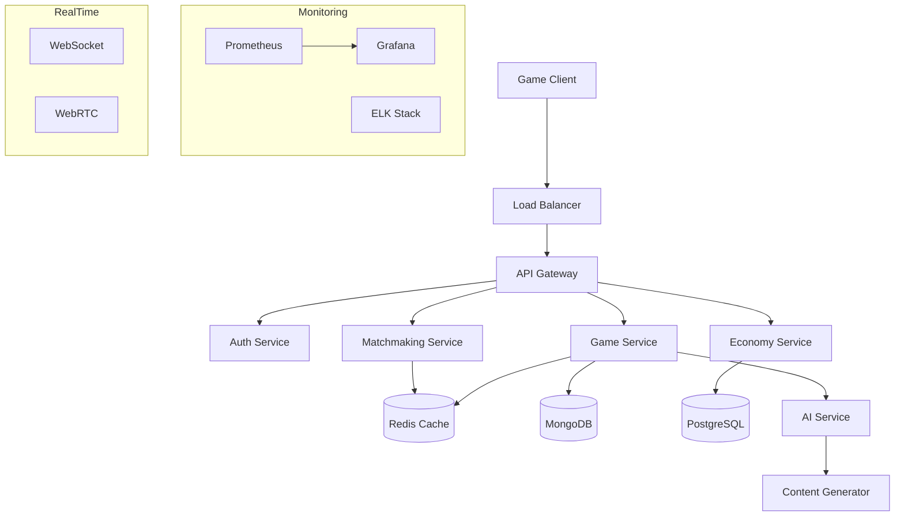

# 🎮 Multiplayer Game Backend

A scalable, production-ready game backend built with **Node.js**, **TypeScript**, and modern cloud technologies. This backend supports real-time multiplayer gameplay, AI-driven features, and a virtual economy, providing a seamless gaming experience for players worldwide.

---

## 🌟 Features

- **Real-Time Multiplayer**: Use of **WebSocket/Socket.IO** for real-time game communication.
- **OAuth2.0/JWT Authentication**: Secure user authentication with social login integration.
- **Skill-Based Matchmaking**: Redis-powered matchmaking system for fair gameplay.
- **Virtual Economy**: Robust economy with anti-fraud mechanisms to prevent exploitation.
- **AI-Driven Content Generation**: Dynamic game content creation powered by artificial intelligence.
- **Real-Time Analytics**: Monitor player activity, performance, and engagement with an interactive dashboard.
- **High-Quality Voice/Video Chat**: Integrated **WebRTC** for seamless in-game communication.
- **Global Cloud Deployment**: Hosted on scalable cloud infrastructure for global availability.
- **AR/VR Support**: Ready for future integration of Augmented Reality and Virtual Reality features.

---

## 🏗 Architecture



---

## 🚀 Getting Started

To get started with the project, follow these steps:

### 1. Prerequisites

Make sure you have the following installed:

- **Node.js** 18+
- **Docker** and **Docker Compose**
- **Redis**
- **PostgreSQL**
- **MongoDB**

### 2. Installation

Clone the repository and install dependencies:

```bash
git clone  https://github.com/fahad0samara/node-advanced-real-time-game.git
cd game-backend
npm install
```

### 3. Environment Setup

Copy the example environment configuration file:

```bash
cp .env.example .env
# Edit .env with your configuration (e.g., database credentials, API keys)
```

### 4. Start Services

Spin up the services using Docker Compose:

```bash
docker-compose up -d
npm run dev
```

---

## 📚 API Documentation

Access the API documentation at `http://localhost:<port>/api-docs` once the server is running.

---

## 🔧 Configuration

Configuration options can be found in `.env.example`. Be sure to review and update the `.env` file based on your setup.

---

## 🧪 Testing

Run the following commands to test your application:

- **Unit tests**:
  ```bash
  npm run test
  ```

- **End-to-end tests**:
  ```bash
  npm run test:e2e
  ```

- **Load tests**:
  ```bash
  npm run test:load
  ```

---

## 📈 Monitoring

You can monitor the system's performance and logs using the following tools:

- **Grafana Dashboard**: `http://localhost:3000`
- **Prometheus**: `http://localhost:9090`
- **ELK Stack**: `http://localhost:5601`

---

## 🔐 Security

The backend is built with security in mind and includes the following features:

- **JWT Authentication** for secure login and session management.
- **Rate Limiting** to prevent abuse of the API.
- **Input Validation** to ensure data integrity.
- **Anti-Cheat System** to detect and prevent malicious behavior.
- **Fraud Detection** to safeguard the virtual economy and in-game purchases.

---

## 📦 Deployment

The backend is designed to be easily deployable to various cloud platforms, including:

- **AWS ECS/EKS** (Elastic Container Service/Elastic Kubernetes Service)
- **Google Cloud Run/GKE** (Google Cloud Run/Google Kubernetes Engine)
- **Azure AKS** (Azure Kubernetes Service)

---

